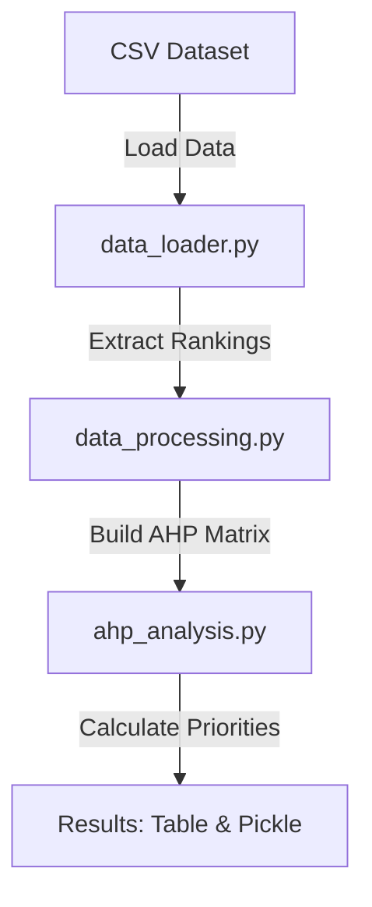

# `src` - Data Processing and Priority Vector Calculation

## Overview
The `src` directory contains the core implementation of the priority vector calculation methodology. It includes the data processing, expert ranking handling, priority vector computation using the **Analytic Hierarchy Process (AHP)**, and consistency evaluation steps. This is where the main data transformation and analysis occur, utilizing expert input to calculate the final priority vectors for factors in a vulnerability assessment.

### What Happens in `src`
- **Data Processing**: The directory handles the input data (such as expert rankings or factors) and processes them into a format suitable for calculation.
- **Priority Vector Calculation**: Using the **Analytic Hierarchy Process (AHP)**, the priority vectors are calculated based on the processed data, representing the relative importance of each factor in the vulnerability assessment.
- **Consistency Evaluation**: After calculating the priority vectors, a consistency check is performed to evaluate the reliability of expert rankings and the resulting priority values.
- **Output**: The results are stored or returned, including the priority vectors, consistency ratios, and ranking data for further analysis or visualization.

## Data Flow Diagram

The following diagram illustrates the data flow within the `src` directory, highlighting the key steps involved in processing expert rankings and calculating priority vectors:

